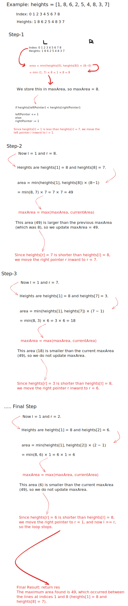

# 3. Max Water Container

Created: October 19, 2024 9:25 AM
Status: Medium
Updated: October 19, 2024 11:01 AM

You are given an integer array `heights` where `heights[i]` represents the height of the ithith bar.

You may choose any two bars to form a container. Return the *maximum* amount of water a container can store.

**Example 1:**

[https://imagedelivery.net/CLfkmk9Wzy8_9HRyug4EVA/77f004c6-e773-4e63-7b99-a2309303c700/public](https://imagedelivery.net/CLfkmk9Wzy8_9HRyug4EVA/77f004c6-e773-4e63-7b99-a2309303c700/public)

```python
Input: height = [1,7,2,5,4,7,3,6]

Output: 36
```

**Example 2:**

```python
Input: height = [2,2,2]

Output: 4
```

**Constraints:**

- `2 <= height.length <= 1000`
- `0 <= height[i] <= 1000`

## Solution

Time Complexity: O(n)  

Space Complexity: O(1)  

```python
'''
The Two Pointers algorithm is used here to efficiently find the maximum area of water a container can hold. 
By initializing two pointers at the beginning and end of the array, we can calculate the area and adjust the pointers 
based on the height comparison, ensuring we explore all potential maximum areas in linear time.
'''

class Solution:
    def maxArea(self, heights: List[int]) -> int:
        
        # Initialize two pointers, one at the start and one at the end of the list
        leftPointer, rightPointer = 0, len(heights) - 1
        
        # Initialize the variable to store the maximum area found
        maxArea = 0
        
        # Loop until the two pointers meet
        while leftPointer < rightPointer:
            
            # Calculate the width between the two pointers
            width = rightPointer - leftPointer
            
            # Calculate the current area with the shorter height
            currentArea = min(heights[leftPointer], heights[rightPointer]) * width
            
            # Update the maximum area if the current area is larger
            maxArea = max(maxArea, currentArea)
            
            # Move the pointer pointing to the shorter line inward
            if heights[leftPointer] < heights[rightPointer]:
                leftPointer += 1
            else:
                rightPointer -= 1
        
        # Return the maximum area found
        return maxArea
```

## Notes

- **Initialization**:
    - You start with one pointer (`leftPointer`) at the beginning and another pointer (`rightPointer`) at the end of the array. This setup lets you shrink the problem space by either moving the left pointer to the right or the right pointer to the left.
- **Sum Comparison**:
    - You compute the sum of the numbers at the two pointers. If the sum is larger than the target, you move the `rightPointer` to the left (to decrease the sum, since the array is sorted). If the sum is smaller, you move the `leftPointer` to the right (to increase the sum).
- **Termination**:
    - When the two pointers meet, you either find the solution or conclude there is none. Since the problem guarantees a solution, you will find the correct pair and return their indices.
- **Efficiency**:
    - This approach runs in **O(n)** time, where `n` is the length of the array, as each pointer moves inward exactly once.
- **Why Use Two Pointers?**
    - The **Two Pointers** technique is useful when dealing with problems where you can efficiently traverse from both ends of a sorted array or list to achieve optimal time complexity. Here's why it works well in problems like **palindrome checking** or **two-sum** in a sorted array

## Example Walkthrough

**Example**: `heights = [1, 8, 6, 2, 5, 4, 8, 3, 7]`

```
Index:     0   1   2   3   4   5   6   7   8
Heights:   1   8   6   2   5   4   8   3   7
```

1. **Initialization**:
    - `l = 0`, `r = 8`, calculate area:
    - area = min(1,  7)  *  (8 - 0) = 8
    - `maxArea = 8`.
2. **Move Shorter Pointer**:
    - Move `l` to `l = 1` since `heights[0] < heights[8]`.
3. **Next Calculation**:
    - `l = 1`, `r = 8`, calculate area:
    - area = min(8, 7) * (8 - 1) = 49
    - Update `maxArea = 49`.
4. **Move Shorter Pointer**:
    - Move `r` to `r = 7` since `heights[8] < heights[1]`.
5. **Next Calculation**:
    - `l = 1`, `r = 7`, calculate area:
    - area = min(8, 3) * (7 - 1) = 18
    - No update, `maxArea = 49`.
6. **Move Shorter Pointer**:
    - Move `r` to `r = 6`.
7. **Next Calculation**:
    - `l = 1`, `r = 6`, calculate area:
    - area = min(8, 8) * (6 - 1) = 40
    - No update, `maxArea = 49`.
8. **Move Shorter Pointer**:
    - Move `r` to `r = 5`.
9. **Next Calculation**:
    - `l = 1`, `r = 5`, calculate area:
    - area} = min(8, 4) * (5 - 1) = 16
    - No update, `maxArea = 49`.
10. **Continue Moving Shorter Pointer**:
    - Repeat the steps for `r = 4, 3, 2`, calculating areas: 15, 4, 6. No updates to `maxArea`.
11. **Final Result**:
    - Maximum area is **49**, found between indices 1 and 8 (`heights[1] = 8` and `heights[8] = 7`).

Visual Walkthrough:



## Edge Cases

```python
# Test with a simple case of two heights
Solution().maxArea([1, 1])

# Test with increasing heights
Solution().maxArea([1, 2, 3, 4, 5])

# Test with decreasing heights
Solution().maxArea([5, 4, 3, 2, 1])

# Test with a peak in the middle
Solution().maxArea([1, 3, 5, 3, 1])

# Test with all heights being the same
Solution().maxArea([4, 4, 4, 4, 4])

# Test with alternating heights
Solution().maxArea([1, 3, 1, 3, 1])

# Test with a single height
Solution().maxArea([5])

# Test with two heights of different values
Solution().maxArea([2, 3])
```

## Similar Questions