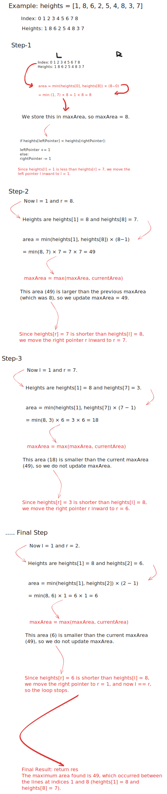

# 3. Max Water Container

Created: October 19, 2024 9:25 AM
Status: Medium
Updated: October 19, 2024 11:01 AM

You are given an integer array `heights` where `heights[i]` represents the height of the ithith bar.

You may choose any two bars to form a container. Return the *maximum* amount of water a container can store.

**Example 1:**


```python
Input: height = [1,7,2,5,4,7,3,6]

Output: 36
```

**Example 2:**

```python
Input: height = [2,2,2]

Output: 4
```

**Constraints:**

- `2 <= height.length <= 1000`
- `0 <= height[i] <= 1000`

## Solution

Time Complexity: O(n)  

Space Complexity: O(1)  

```python
'''
The Two Pointers algorithm is used here to efficiently find the maximum area of water a container can hold. 
By initializing two pointers at the beginning and end of the array, we can calculate the area and adjust the pointers 
based on the height comparison, ensuring we explore all potential maximum areas in linear time.
'''

class Solution:
    def maxArea(self, heights: List[int]) -> int:
        
        # Initialize two pointers, one at the start and one at the end of the list
        leftPointer, rightPointer = 0, len(heights) - 1
        
        # Initialize the variable to store the maximum area found
        maxArea = 0
        
        # Loop until the two pointers meet
        while leftPointer < rightPointer:
            
            # Calculate the width between the two pointers
            width = rightPointer - leftPointer
            
            # Calculate the current area with the shorter height
            currentArea = min(heights[leftPointer], heights[rightPointer]) * width
            
            # Update the maximum area if the current area is larger
            maxArea = max(maxArea, currentArea)
            
            # Move the pointer pointing to the shorter line inward
            if heights[leftPointer] < heights[rightPointer]:
                leftPointer += 1
            else:
                rightPointer -= 1
        
        # Return the maximum area found
        return maxArea
```

## Notes
- **Objective**:
    - Find the maximum area of water that can be contained between two vertical lines in an array `heights`. The area is determined by the shorter line's height and the distance between the two lines.
- **Approach**:
    - Use the **Two Pointers** technique, starting with one pointer (`l`) at the beginning and the other (`r`) at the end of the array. The idea is to calculate the area between the two lines, update the maximum area, and move the pointer corresponding to the shorter line inward.
- **Key Steps**:
    1. **Initialize** `l = 0`, `r = len(heights) - 1`, and `maxArea = 0`.
    2. **While** `leftPointer < rightPointer`, 
    
        ```python
        calculate:
            width = rightPointer - leftPointer
            currentArea = min(heights[leftPointer], heights[rightPointer]) × width
        ```
        
    3. **Update** `maxArea` with the larger value between `maxArea` and `area`.

        ```python
        maxArea = max(maxArea, currentArea) 
        ```

    4. **Move** the pointer pointing to the shorter height inward to potentially find a taller line that could give a larger area.

       ```python
        if heights[leftPointer] < heights[rightPointer]:
           leftPointer += 1
       else:
           rightPointer -= 1
       ```
    
- **Why Two Pointers**:
    - This method explores all possible container configurations in **O(n)** time by narrowing down possible maximum areas with each step. Moving the shorter pointer increases the chance of finding a taller container.
- **Time Complexity**: **O(n)** – Each element is processed at most once by the two pointers.
- **Space Complexity**: **O(1)** – Only a few variables are used, regardless of input size.

## Example Walkthrough

**Visual Walkthrough**




**Complete Example Walkthrough**: `heights = [1, 8, 6, 2, 5, 4, 8, 3, 7]`

```
Index:     0   1   2   3   4   5   6   7   8
Heights:   1   8   6   2   5   4   8   3   7
```

1. **Initialization**:
    - `l = 0`, `r = 8`, calculate area:
    - area = min(1,  7)  *  (8 - 0) = 8
    - `maxArea = 8`.
2. **Move Shorter Pointer**:
    - Move `l` to `l = 1` since `heights[0] < heights[8]`.
3. **Next Calculation**:
    - `l = 1`, `r = 8`, calculate area:
    - area = min(8, 7) * (8 - 1) = 49
    - Update `maxArea = 49`.
4. **Move Shorter Pointer**:
    - Move `r` to `r = 7` since `heights[8] < heights[1]`.
5. **Next Calculation**:
    - `l = 1`, `r = 7`, calculate area:
    - area = min(8, 3) * (7 - 1) = 18
    - No update, `maxArea = 49`.
6. **Move Shorter Pointer**:
    - Move `r` to `r = 6`.
7. **Next Calculation**:
    - `l = 1`, `r = 6`, calculate area:
    - area = min(8, 8) * (6 - 1) = 40
    - No update, `maxArea = 49`.
8. **Move Shorter Pointer**:
    - Move `r` to `r = 5`.
9. **Next Calculation**:
    - `l = 1`, `r = 5`, calculate area:
    - area} = min(8, 4) * (5 - 1) = 16
    - No update, `maxArea = 49`.
10. **Continue Moving Shorter Pointer**:
    - Repeat the steps for `r = 4, 3, 2`, calculating areas: 15, 4, 6. No updates to `maxArea`.
11. **Final Result**:
    - Maximum area is **49**, found between indices 1 and 8 (`heights[1] = 8` and `heights[8] = 7`).


## Edge Cases
```python
# Test with a simple case of two heights
Solution().maxArea([1, 1])

# Test with increasing heights
Solution().maxArea([1, 2, 3, 4, 5])

# Test with decreasing heights
Solution().maxArea([5, 4, 3, 2, 1])

# Test with a peak in the middle
Solution().maxArea([1, 3, 5, 3, 1])

# Test with all heights being the same
Solution().maxArea([4, 4, 4, 4, 4])

# Test with alternating heights
Solution().maxArea([1, 3, 1, 3, 1])

# Test with a single height
Solution().maxArea([5])

# Test with two heights of different values
Solution().maxArea([2, 3])
```

## Similar Questions
